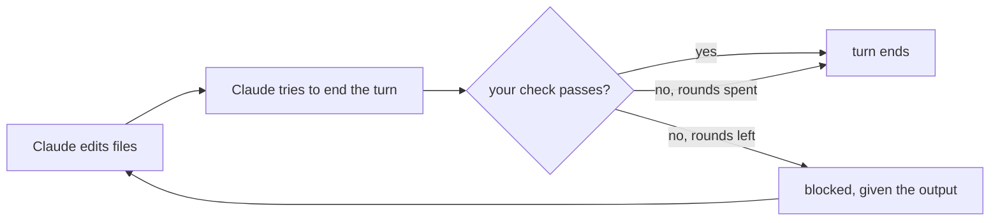

# kkamak

kkamak is a completion gate for Claude Code: it stops the agent from claiming a turn is done until a check you configure — usually your test suite — actually passes.

When Claude finishes a turn in which it edited files, the gate runs your check. If the check fails, Claude is blocked and handed the failure output, and it has to keep working. After a configured number of failed rounds the gate gives up and lets the turn through, so it can never trap a session.



An opencode adapter also ships in this repo; it is experimental and documented separately in [`docs/opencode.md`](docs/opencode.md).

## Install

**Prerequisite:** `bun` must be on `PATH`. Hook processes inherit Claude Code's environment, which for a GUI-launched Claude may not be your terminal's — if `bun` is missing the hook cannot run and the gate fails open silently. Verify with `bun -v` from the same context you launch Claude in.

```bash
claude plugin marketplace add th-yoo/kkamak
claude plugin install kkamak@kkamak
```

Installation is per-machine, not per-repo: it does not travel with a checkout, so run these once on each machine. The install is a copy, not a live reference — after pulling a new version, run `claude plugin marketplace update kkamak` and reinstall.

For development against a checkout, skip the marketplace and load it directly: `claude --plugin-dir /path/to/kkamak` (one session only).

**Confirm it loaded.** kkamak fails open by design — any internal error allows the turn through — so a gate that never loaded looks exactly like a check that always passes. On first use, point `check` at something that fails, edit a file, and end your turn. You should be blocked. Silence means it is not running.

## Set up `gate.json`

Run `/kkamak:init` in Claude Code for a walkthrough that detects your check command and writes the file. For the same thing without a model call, run the CLI directly — `${CLAUDE_PLUGIN_ROOT}` only resolves inside a Claude Code command body, not in a plain shell, so use a real path:

```bash
# from the installed plugin
bun ~/.claude/plugins/cache/kkamak/kkamak/0.5.0/src/cli/init-cli.ts --check 'bun test'
# or from a checkout
bun /path/to/kkamak/src/cli/init-cli.ts --check 'bun test'
```

By default the CLI also adds a `.km/` line to `.gitignore` (creating the file if needed), unconditionally — pass `--no-gitignore` to skip that and manage it yourself.

Or write it yourself at the directory you launch Claude Code from — normally the repo root:

```json
{ "check": "bun test", "rounds": 2 }
```

That location is not a guess: the gate reads `gate.json` from the working directory Claude Code reports in its hook payload, and never searches upward from it. Launch Claude Code from a subdirectory that has no `gate.json` and the gate finds no config and does nothing — which, per "Confirm it loaded" above, looks exactly like a check that always passes.

Keep the check cheap. It runs every time the agent tries to finish a turn in which it edited a file — not once at the end of a session — so a slow check is paid over and over.

| field            | required | default                     | meaning |
|------------------|----------|------------------------------|---------|
| `check`          | yes      | —                            | Shell command to run as the completion check. A config with no non-empty `check` string disables the gate entirely (no-op). |
| `rounds`         | no       | `2`                          | How many failing checks the gate will block on before giving up. `rounds: 2` means: the first and second failing checks each produce a block, and the third failing check is allowed through. `rounds: 0` is observe-only — the check still runs and is recorded, but the very first failure is let through unblocked. |
| `sensor`         | no       | `.km/gate-outcomes.ndjson`   | Where outcome lines are appended, relative to the directory Claude Code was launched from (the same directory `gate.json` is read from). |
| `checkTimeoutMs` | no       | `300000` (5 minutes)         | Hard cap on one check run; a check that runs past this is killed and counted as a failed round. |
| `marker`         | no       | `false`                      | If `true`, a clean accept (not a block, not an exhausted give-up) also returns a hygiene notice — advisory text saying this cycle's check evidence is closed and should not be carried into unrelated work. Same-cycle only; nothing is persisted across sessions. |

Keep `checkTimeoutMs` under 600000 (600s): the `Stop` hook in `hooks/hooks.json` has its own 600s timeout, and if that fires first, Claude Code kills the hook process before the gate records a decision — fail-open still holds (no state written, no round consumed), but the check silently never gets its full configured time.

Since 0.5.0 the gate no longer lets that happen silently. Under Claude Code it knows the hook's own ceiling, and a `checkTimeoutMs` that leaves no room beneath it is clamped to fit, with a stderr line naming both numbers and the largest value that would fit. The gate needs a slice of that ceiling for itself — loading state, running the check, writing the record — and a configured value that consumes all of it is a value the process gets killed in the middle of. Under opencode nothing kills the handler, so nothing is clamped.

## What kkamak can and cannot touch

kkamak never modifies your source files. It writes exactly three paths:

- `gate.json` — only when you run `/kkamak:init` or the init CLI, and it refuses to overwrite an existing one without `--force`.
- `.gitignore` — only to add a `.km/` line, same occasion, never duplicated.
- `.km/` — gitignored runtime state and the append-only sensor log.

kkamak has no command of its own beyond that: it reads `gate.json` and runs whatever `check` it names. Installing it and opening a repo with no `gate.json` changes nothing at all — the gate is inert until one exists.

**Trust model.** That `check` command is not sandboxed. It runs as a shell command with your full user privileges, in your working directory, on every turn that edited a file — without a Claude Code permission prompt, because a `Stop` hook is not a tool call. It can do anything you can do.

`gate.json` is a repo file, so its `check` is whatever that repo contains. Treat a `gate.json` from a repo you did not write exactly as you would treat any executable script from that repo: read it before opening the repo in Claude Code.

## Turning it off

The gate re-reads `gate.json` on every event and holds nothing in memory. Edit or delete it and the change applies on the very next turn — no restart, no reinstall.

The gate also disarms itself: if the check *cannot be run* (a spawn failure, not a failing test) three times in a row in a session, it gives up for the rest of that session and allows everything through, with a notice telling you to check the `check` command. A normal failing check does not count toward this — only a check the gate could not execute at all.

## Delivery channels

`marker` and `notice` always deliver over separate channels, never merged. Under Claude Code, `marker` rides `hookSpecificOutput.additionalContext` on the `Stop` hook's response — the field that reaches the model's own context — while `notice` is diagnostic and surfaces as a `systemMessage` status line only. `marker` is recorded on the sensor line either way, independent of delivery.

## The sensor file

Each completed gate cycle appends one JSON line to the sensor file (default `.km/gate-outcomes.ndjson`). Example, generated by driving the Claude Code hook CLI against a scratch repo:

```json
{"ts":1786514479665,"sessionID":"demo-session-1","check":"test -f .fail_once && rm .fail_once && exit 1 || exit 0","accepted":true,"gateExhausted":false,"interrupted":false,"rounds":["verify-failed","accepted"],"durationMs":82,"host":"yoo-dev","app":"claude-code","marker":false,"pluginVersion":"0.5.0","product":"kkamak","checkMs":[6,5],"roundsMax":2}
```

Fields:

- `ts`, `sessionID`, `check`, `host`, `app` — identity and timing of the cycle.
- `accepted` — true whenever the stop was ultimately allowed through.
- `gateExhausted` — true when the `rounds` budget ran out rather than the check passing.
- `interrupted` — true whenever a new user prompt cut measurement short: preempting an open cycle, or (see `skippedStop`) arriving before one ever reached a stop.
- `rounds` — `"accepted"`/`"verify-failed"` per check attempt in the cycle.
- `durationMs` — whole-cycle wall time, including agent think time, subagent runs and human wait.
- `marker` — true iff this cycle injected the hygiene notice described in the `gate.json` table above: the `marker` config was on and the round was a clean accept. Always `false` on a block, an exhausted give-up, or an interrupted/skipped line, even with the config on. Same-cycle, same-session only — despite this field's name, nothing here is ever persisted or read back across sessions.
- `pluginVersion` — this kernel's own version (`package.json`'s `version`), stamped on every line. Optional on the downstream consumer's frozen contract, since a producer may be unable to determine its own version; this kernel always can, so it is never absent here.
- `product` — which gate implementation wrote this line, always `"kkamak"` here (`package.json`'s `name`). Not configurable: `gate.json` cannot set or override it, which is the point. `pluginVersion` alone cannot identify a producer — version numbers can overlap between separate implementations that both write to the default sensor path, and a line's version says nothing about who stamped it. This field is that identity. It cannot label lines written before it existed, so absence means "not this build, or older than 0.5.0", not "not kkamak".
- `roundsMax` — the `rounds` budget this cycle was measured against, so an exhaustion rate can be read without guessing which `gate.json` was in force at the time. Two windows recorded under different `rounds` settings are not comparable, and before this field there was nothing on the line to tell you they differed.
- `checkMs` *(optional)* — per-round check execution time only, parallel to `rounds`. `durationMs` alone can't tell you what the check itself costs: an observed 420-second cycle contained a ~1-second check.
- `skippedStop` *(optional)* — present and `true` only on a diagnostic line: a queued user message consumed a turn boundary before a stop was ever delivered, so no check ran and `rounds` is empty. The session stays armed, so the next real stop still measures the accumulated edits. Without this field, that session would look identical to one with no edits at all.
- `forced` *(optional)* — true iff an env override forced this session's reinject arm. The downstream consumer's frozen contract scopes this to `KKAMAK_REINJECT`; this kernel has no reinject-arm mechanism at all, so it never sets this field today.

All optional fields may be absent from any given line; a consumer must tolerate that.

## Docs

- [`docs/opencode.md`](docs/opencode.md) — the experimental opencode adapter.
- [`CHANGELOG.md`](CHANGELOG.md) — notable changes.
- [`docs/install-verification.md`](docs/install-verification.md) — the runbook a maintainer executes on a real machine after cutting a release, to prove the published plugin actually installs and blocks. Not needed to *use* kkamak.

MIT licensed.
